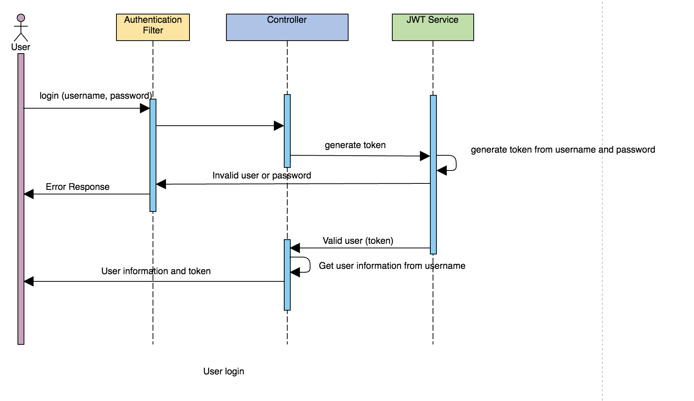
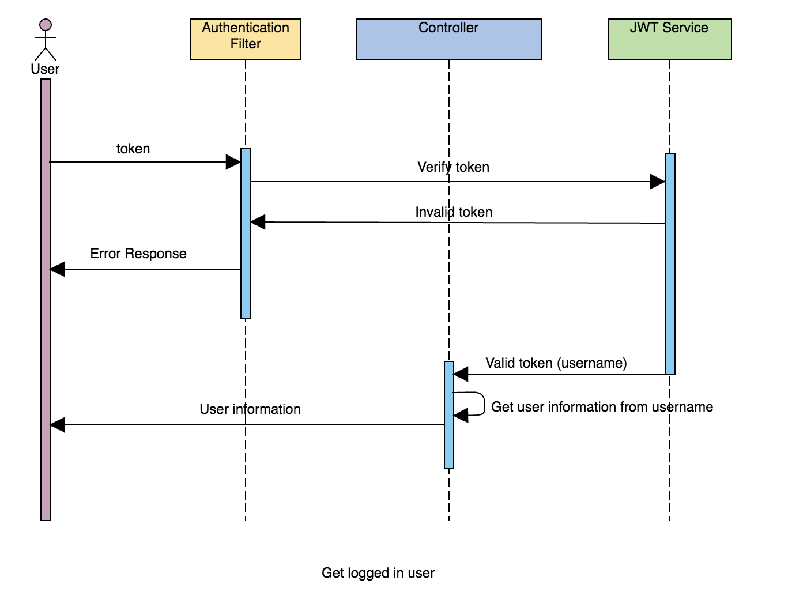
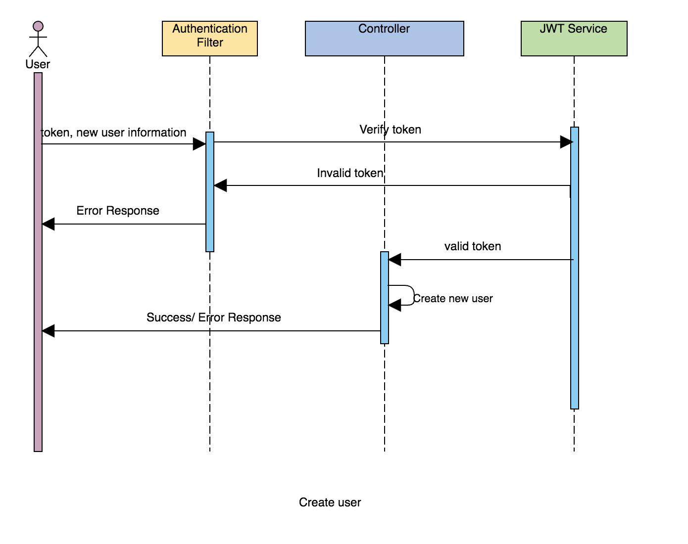
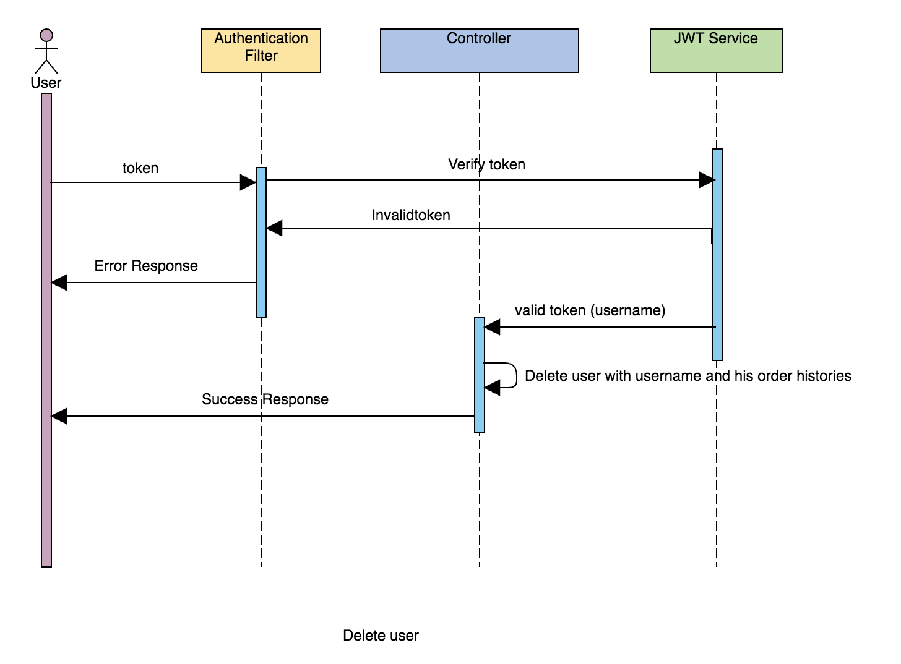
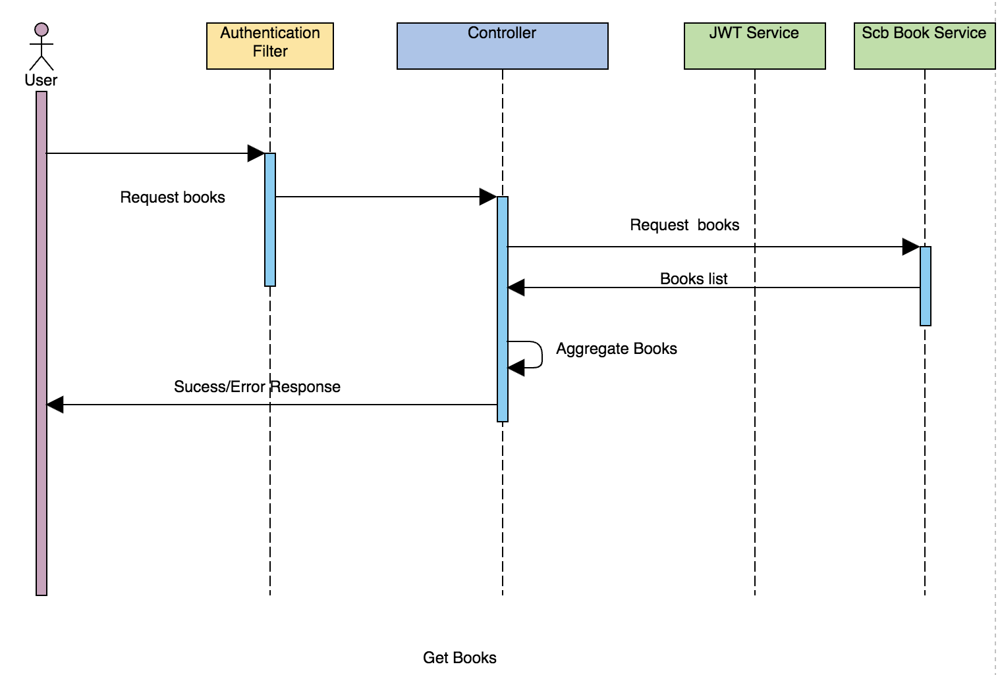
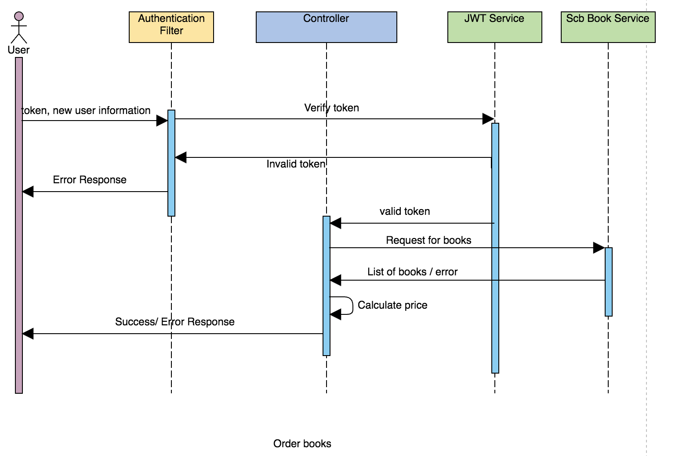

# scbSpringBootTesting

### Login


### Get user


### Create new user


### Delete user


### List books


### Order book


### Setting up Lombok with Eclipse

- https://www.baeldung.com/lombok-ide
Please checkout the project from 
https://github.com/peasunseries/book-store.git

## How to run the application?
~~~
git clone https://github.com/peasunseries/book-store.git
cd book-store
mvn clean install
mvn spring-boot:run

~~~

## What's inside 
This project is based on the [Spring Boot](http://projects.spring.io/spring-boot/) project and uses these packages :
- Maven
- Spring Core
- Spring Data (Hibernate & MySQL)

## Database configuration 
Create a MySQL database with the name `springbootdb`and add the credentials to `/resources/application.properties`.  
The default ones are :
```
spring.datasource.url=jdbc:mysql://localhost:3306/bookstore
spring.datasource.username=root
spring.datasource.password=
spring.jpa.hibernate.ddl-auto=update
```
DataBase Script in Project  /src/main/resources/
** If mvn clean install , The Unit Test Failed and ignore test

~~~
 mvn clean install -DskipTests
~~~
API docs via swagger, you can access to 

- https://localhost:8443/swagger-ui.html#/
